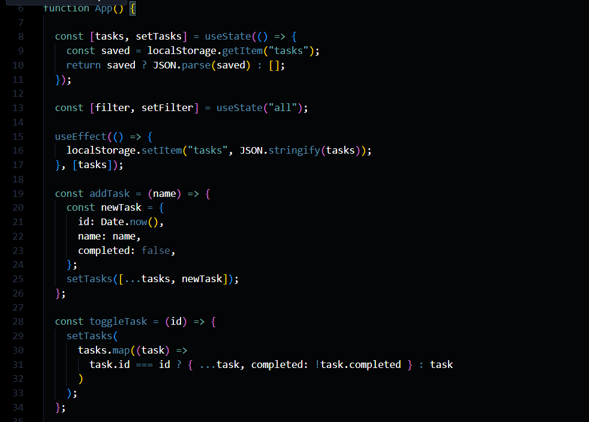
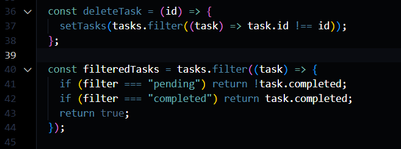
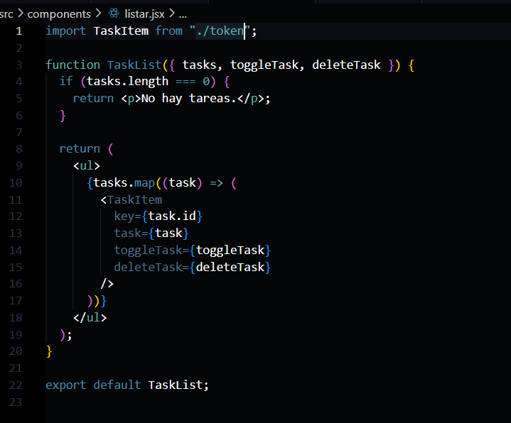
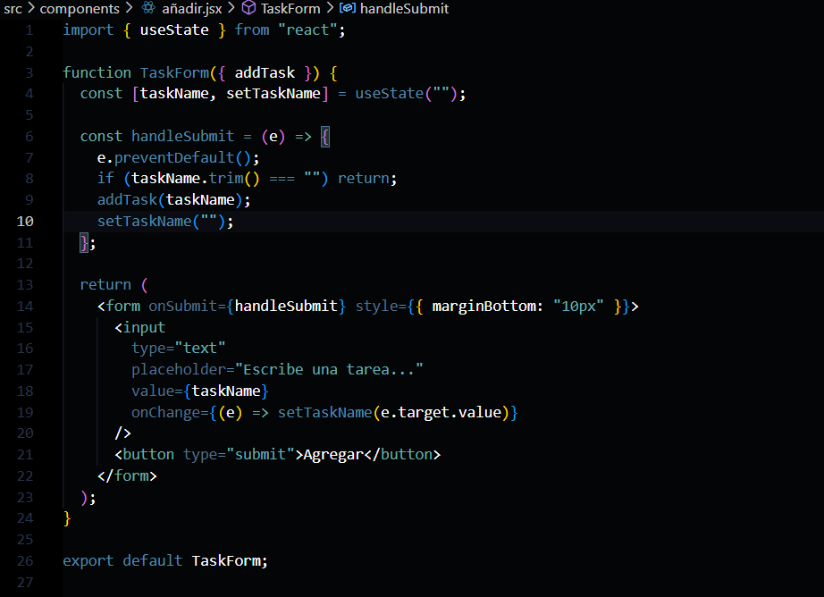
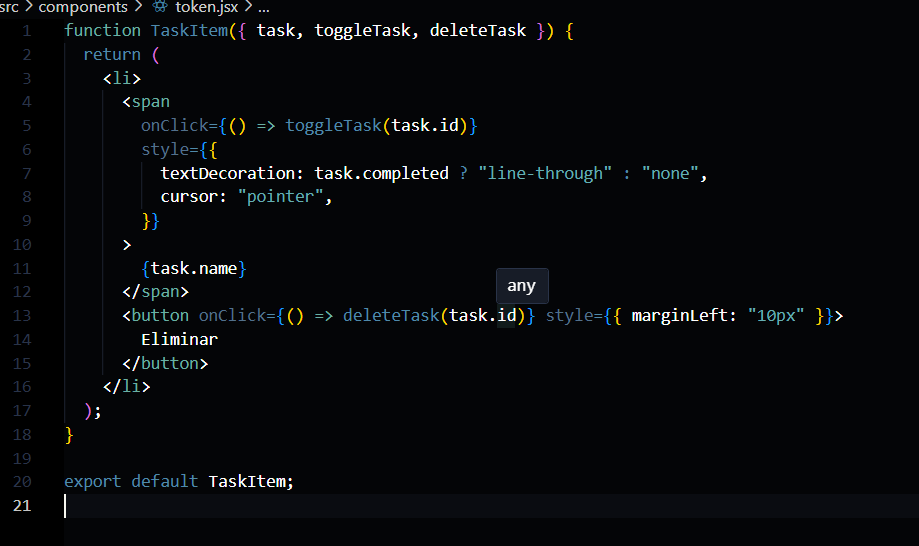

Funcion App desplega la aplicacion,  "task" obtiene las tareas, "useEffect" agrega las tareas al localstroge, "addtask" 

"deletetask" para eliminar la tarea y "filteredTasks" para filtrarla

Lista las tareas

Agrega las tareas

Tacha las tareas terminadas, y elmina

Pagina: 
dcxeosyi1n7m.cloudfront.net